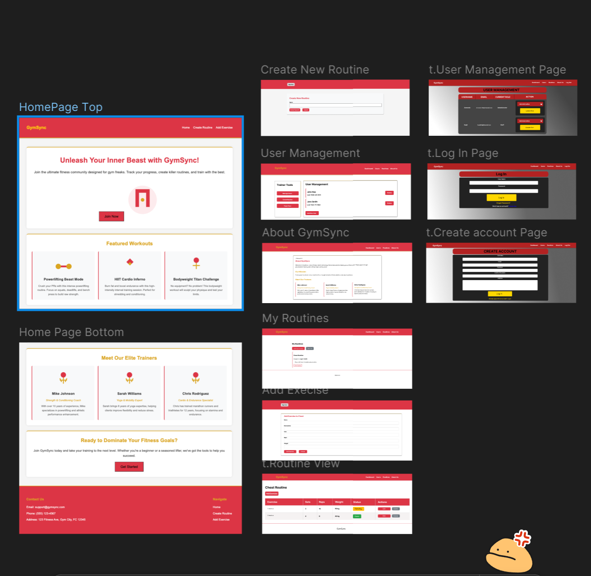

# CONTRIBUTIONS 

## Group 6
## Week 8 (Total Hours Spent 4 Hours)

### Tasks
1) Create a group of 3 students. 
2) Plan the app  
3) review instructions. 
4) Choose the programming languages. 
5) Create a plan of action. 
6) Create a repository. 
7) Get started on the project. 

## The App Idea
# Gym App Description
 **User Accounts**: 
  - Users can create accounts and log in to the app.
  - Users upload and track their gym routine.

**Task Management**: 
  - Users can input and manage their workout routines.
  - Option to prioritize exercises based on time, intensity, or AI suggestions.
  
**AI Integration**:
  - AI suggests the optimal order of exercises based on user preferences, goals, or available time.

**User Roles**:
  - **Gym Staff**: Can view and manage active users, routines, and membership details.
  - **Admin**: Manages staff, users, and app settings.

**Membership Details**:
  - Gym staff can see detailed information about each user’s membership (e.g., expiration, type).

**Database**:
  - Backend powered by Django with SQLite for storing user, routine, and membership data.

**Tech Stack**:
  - Frontend: User-friendly interface
  - Backend: Django + Python
  - Database: SQLite

_______________________________________________________________________
# Day 1 Week 8 Plan In Class (Slack Communication)

## The plan:
### March 4th, 2025                          Planning Coding Project
### App Name: Gym Planner

### Languages: Python/JavaScript, SQLite, dJango

### Key Features of app:
#### Admin:
 Can add or delete team lead or team members.
 Full access to the schedules of team lead.
 Active status of team lead & team members (clocked in or clocked out?)
 

#### Team Lead (trainer): 
  Access to create routines for users.
 Add or delete users.
 How long a how long was the user in the gym.
 

#### Users:
 Can get access to custom routines.
 manage routines by themselves.
 access to the massage chairs.
 
#### Plan:
1. Create GitHub Repository,
2. Assign 3 tasks (one each),
3.  Establish the Key features of the app.
4. Choose group leader = Armando

#### Assigned Tasks:
Tysen:
 Can add or delete team lead or team members.
 

#### Sujal:
 Full access to the schedules of team lead.
 

#### Armando:
Active status of team lead & team members (clocked in or clocked out?)
We spoke about Code review, Armando taking the team lead, we will each create modular functions in the chosen languages. Once the functions are created they will be reviewed by the group, and the decision to implement the code into the main code will be made.
Each day we will check slack, and work on good communication practices.
_______________________________________________________________________

# Week 9 (Total Hours Spent 3.5 - 4.5)

### Progress:
- I created a User interface which contains an add or delete button, and the code is written in **HTML** and **CSS**. The page was based on my assigned task from week 8. The page has a design, and is coded for multiple sized screens. 

**Research**:
- I researched about HTML and CSS for refresher of the coding. 
- I spent some time watching videos provided by Armando about **DJANGO**
 

### Challenges: 
- One challenge I faced was I do not know the languages DJANGO, SQLITE, or PYTHON. I find it very difficult for me to be able to program and contribute the the code, when I need to do extensive time and research to be able to contribute to this project effectively and efficiently. 
- My other courses homework is consuming much of my needed time to be able to spend the time needed, but I am committed to doing the best job I can on this project. 
- When I message on **Slack** I rarely get a reply from my group members, and I find it difficult to communicate, So this area can use immediate improvement. However, I will say that once in person and on the topic, we work well as a group. I feel that possibly we all are very consumed by homework and life challenges which is a factor. 

### My Plan: 
- As spoke about with Dibya my Instructor, we decided that I can focus on the Front end of the project, and the mock up. I do understand HTML and CSS much better at this time then PYTHON or DJANGO, so it was decided that my main focus could be on the front end of the project.
- I plan to create a mock up of the pages for the app. 
- I plan to Code some of the pages, according to the specific needs of each page.
- I plan to research and learn what I can about DJANGO and PYTHON. 
- I plan to make regular commits, and put in the time needed to play a large role in contributing to this project.

### Reference to Research: 
**DJANGO Youtube Video**
[Django Youtube Video tutorial](https://www.youtube.com/watch?v=t01LGgGJNBI)

### Group work: 
- A repository was created where we can contribute. 
- There has been some communication on Slack, but needs improvement. 

_____________________________________________________________________________________________

# Week Week 10 (Total Hours Spent 4 Hours ) (More to be added this week)

### Progress:
- I have spent hours in research of html and css, and researching how to code for multiple screens, and  additionally researching about Django and Python. 
- I have forked the **GitHub Repository** and cloned this to my local machine, I then moved my files from an isolated folder over into my forked repository. 
- I researched how to use GitHub as my knowledge is limited on this topic. 
- In GitHub I **Created an Issue** to be able to communicate using github and to break the ice with my group and get more activity happening in the project. 
- Notified my group on slack of the Issue I have created. 
- We have spoke in slack about possible themes or colors involved in the project.

### Challenges: 
- Frequent communication has taken place on Slack with my group, but it has been difficult with this, as everyone does not answer very quickly. 
- Overloaded with homework has set me back a lot, and caused me to not have the time I need to focus ont his project as much as I would like. 

### My Plan: 
- My plan is to move all my files over to the forked group project.
- I will make a better effort of documenting on github using the issue I have created.
- I plan to create/ Complete all UI pages this week, with regular commits. 
- I would like to create a Mock up and mood board. 

### Reference to Research: 
- Bright Space week 11 videos about GitHub. 
- W3 Schools website[W3_SchoolsLearnDjango](https://www.w3schools.com/django/index.php)
- W3 Schools Website[W3_SchoolsLearnPython](https://www.w3schools.com/python/)
- YouTube beginner to Python Website[YouTube_Video_Python]https://www.bing.com/videos/riverview/relatedvideo?q=learn+python+&mid=AC78F45084274CB5E4FDAC78F45084274CB5E4FD&mcid=0AA1DB10E2714FC4B6F2DCC1560D0126&FORM=VIRE

_______________________________________________________________________

# Week 11 (Total Hours Spent 6 Hours) (More to be added this week)

### Progress:
- This week I re-created the user-management page to meet our teams themes and goals. 
- I went over the plan with Armando in class and I now have more to work with. 
- As part of this project I have been researching the different languages so as I go and will provide a few links to resources. 
- I looked at the pages that Sujal has created, and I am trying to create ones that we do not have yet.

### Challenges: 
- My largest obstacle is my other homework, I spent nearly 60 hours approx on my coding assignment for 114, and near the end I lost my entire project. 
- My next largest obstacle is communication with my team, we seem to have a very difficult time communicating, and I can tell it is picking up near the end of this course, but it has been very poor.
- I have been very eager to work on things, but I have felt stuck many times, because I do not understand the other codes, and it has thrown me off. 

### My Plan: 
- Now that I am beginning to finally catch up on some of my other courses, I plan to create a page everyday. 
- My hours put in will be fully accounted for and then some by the end of this course, and I realize I have not been able to complete a lot but the effort has been there. 
- 

### Reference to Research: 

________________________________________________________________________________

# Week 12 (Total Hours Spent 5+ Hours)

### Progress: 
- The group had communications and we decided it would be important for us to create a Mock-Up of the pages we would create. 
- I was able to practice working as a group on an online project. 
- I was able to create the admin log in and the create account pages.  
- The group needed a better way to communicate, so I decided to create a GitHub issue, as this would be a place that the instructor would me capable of viewing our work. 
- I have began creating more mockups
- I have updated my codes ont he laptop and made attempts to add code. 

### Challenges:
- Communication has been the largest challenge, I have had moments where the communication seemed next to impossible during this project, and I am finding that this is beginning to be resolved with the GitHub Issue I have created. 
- I have been trying to learn django and Python, but since I am very limited on my time, I am struggling to pick up on what is going on. 
- There was issues with setting up my laptop to be able to use python and django early on, so my challenge is I have trouble seeing what has been done other than looking at the codes. 

### My plan:
- I plan to get any questions I have about our project answered so I can get some more clear direction as to who is doing what and which pages are needed. for now I will continue to create the mock ups, and help with communication efforts.
- I plan to create more of the needed pages, and also to review the current code with Armando.
- I plan to learn about how our Python code works, because I want to be able to explain it. 

__________________________________________________________________________________________

# Week 12 (Total Hours Spent 10+ Hours)

### Progress: 
- The group I feel has really pulled together at this point, and we are getting a lot more traction as the final deadlines approach. 
- Communication has been good.
- We have had virtual meetings, and our communication if at this level would have made the entire project run a lot smoother. 
- I was able to do some online testing of the app in order to find any bugs or things to fix
- Researched the mvvm ans mvc and how it might be related to our project. 
 
     ### up to this point Pages I have completed:
     - User Management (admin)
     - Log In Page (admin)
     - Create Account Page (admin)
     - Create Routines Page 
     - Routine Views Page
     - All css pages for the pages I had created as well

## Mock-Up

###  Challenges:
The largest challenge has been communication, but at this point I feel we have accomplished that goal to communicate better. We had multiple meetings in person or virtual. which helped a lot.  

### Reference to Research: 
- [link_for_mvvm_mvc_research](https://medium.com/@madelinecorman/design-patterns-mvc-vs-mvvm-f680183646f9)
- [link_for_mvvm_mvc_research](https://www.bing.com/videos/riverview/relatedvideo?q=mvvm+mvc+what+are+they+%3f&&view=riverview&mmscn=mtsc&mid=96E2AE17112CBACDB29796E2AE17112CBACDB297&&aps=38&FORM=VMSOVR)
____________________________________________________________________________________________

# Final Summary and Conclusion: 

Throughout this project, our team developed a gym management app using Django and Python. As a member of the team, my primary focus was on communication, collaboration, and learning as much as I could about coding practices and technologies. Although my coding contributions were limited compared to my teammates, I feel that my involvement in other aspects of the project significantly enhanced the outcome and my understanding of how development workflows operate in a team setting.

**Team Collaboration and Communication**
One of the most important takeaways from this project was the value of effective communication in a collaborative environment. Early on, our team faced challenges in communication, which made it difficult for me to understand my role and how I could best contribute. However, as the project progressed, I took the initiative to improve communication within the team. I created a GitHub issue page to help us track tasks and communicate efficiently as well as resolve any issues we were having. I also encouraged my teammates to actively use the communication channels, which ultimately improved our workflow and allowed for a smoother development process.

**Technical Learning and Growth**
Although I struggled with the complexity of Django and Python, I made significant strides in my technical knowledge. As someone who is still learning programming with a focus on JavaScript, HTML, and CSS, the Django framework and Python were new challenges for me. Despite this, I gained valuable experience working with databases and learned about debugging and testing. I also worked with version control using GitHub, which has become a vital skill for any developer.

I spent time learning about the **MVVM** (Model-View-ViewModel) **design pattern** and **MVC** (Model-View-Controller) architecture. These patterns were essential in structuring our app’s code. Additionally, I learned about the role of **Object-Oriented Programming** (OOP) in building scalable and maintainable applications. Although I didn’t write the most code, understanding these concepts helped me contribute meaningfully to the project’s structure and design by having technical conversations with my team member. 

Here is some ways our code may use these things (Note that for these topics, I did use things like chat gpt, Youtube, Google, W3, Stack Overflow, and other, to assist me in trying to learn how our code uses these things. However I did so with the intention on learning): 

### MVC/MTV 
- **Model**: The Customer, Exercise, Routine, and RoutineExercise models define the data structure.
- **View**: Templates like home.html, signup.html, and client_home.html handle the UI.
- **Controller**: The views add_routine, admin_home, control the flow of data between the model and templates.

### MVVM 
- **Model**: Same as the Model in MVC, for **example:** CustomUser, Routine.
- **View**: Templates client_home.html display the UI.
- **ViewModel**: Is handled by views that prepare data for templates, like passing routines to client_home.

### OOP
- **Encapsulation**: Classes like CustomUser and Routine bundle data  and behavior methods like is_admin().
- **Inheritance**: CustomUser inherits from AbstractUser to add custom fields like phone and address.
- **Abstraction**: Classes abstract database operations, allowing interaction at a higher level.

### Factory Pattern
- **Usage**: The get_success_url() method in CustomLoginView returns different URLs based on the user's role admin, staff, client.

### Singleton Pattern
- **Usage**: Each view is instantiated once per request in Django, following the Singleton pattern to ensure efficient reuse of view objects.

**Design and Mockups**
My primary contributions to the project involved creating mockups in Figma for each page of the app. This included designing layouts and user interfaces for the admin, trainer, and gym member pages, ensuring that the user experience was intuitive and functional. The mockups served as blueprints for the front-end development and provided clear visual guidance for the implementation of features.

**Functional Programming and Object-Oriented Programming**
I also became familiar with Functional Programming (FP) and Object-Oriented Programming (OOP) paradigms. While our project was heavily influenced by OOP principles (thanks to Django’s class-based views and models), I gained insight into how functional programming could help with building efficient, reusable code. Even though my exposure to FP was limited, it sparked my curiosity about combining these two programming approaches to write cleaner and more modular code.

**Database and Application Logic**
Working with databases was one of the most important part of this project. I gained experience in understanding how data is structured and stored, and how this affects the functionality of an app. I didn’t directly write the database models, I collaborated with my teammates in designing the database, which was crucial for managing users, workouts, and other app data. I also learned how the app’s logic, including routines and scheduling, was implemented on the back end to serve different user types (admin, trainer, member).

**Final Thoughts**
Despite my initial struggles with Django and Python, I gained an understanding of the importance of effective communication and teamwork in the development process. The ability to create something tangible, like a working app that could be used by others, was a rewarding experience. It showed me how each part of the project, from the design mockups to the code implementation, contributed to a functional product.

The project also gave me a practical understanding of how software design patterns, OOP principles, and database management work together in building real-world applications. As I continue my learning journey, I plan to build on these lessons, particularly in JavaScript, HTML, CSS, and other languages, while improving my coding skills in Python and Django.

Overall, this project has significantly expanded my understanding of app development and has given me the tools to collaborate better, think critically about software architecture, and grow as a programmer.